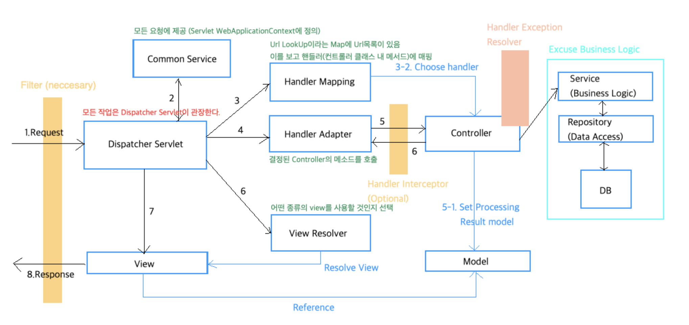

# 1. Spring Web MVC

- Spring 초기 부터 지원되는 Servlet API 기반 web framework 
- 탐캣같은 서블릿 컨테이너를 사용하기 쉽게 이쁘게 감싸준 프레임워크 

## 1.1. DispatcherServlet

- Front Controller pattern 기반의 시작점
  -  FrontController 패턴 특징
  -  프론트 컨트롤러 서블릿 하나로 클라이언트의 요청을 받음 프론트 컨트롤러가 요청에 맞는 컨트롤러를 찾아서 호출
  -  각 컨트롤러마다 서블릿을 사용하지 않고, Controller 앞단에 공통처리를 해주는 Servlet = DispatcherServlet 
    
- web.xml / (요즘은)java config 에서 정의되고 경로 매핑 됨
 - java servlet 에 접근하기 위해 WAS에 필요한 정보를 알려주게 되는데, 그것을 정의하는 곳이 web.xml

<web-app>
        <servlet>
                <servlet-name>example</servlet-name>
                <servlet-class>org.springframework.web.servlet.DispatcherServlet</servlet-class>
                <load-on-startup>1</load-on-startup>
        </servlet>

        <servlet-mapping>
                <servlet-name>example</servlet-name>
                <url-pattern>/example/*</url-pattern>
        </servlet-mapping>

</web-app> 
 
 
- DispatcherServlet은 request 매핑, view resolution, 예외 처리 등 필요한 컴포넌트을 찾기 위해서 스프링 환경설정을 사용합니다.
public class MyWebApplicationInitializer implements WebApplicationInitializer
 
### 1.1.1. Context Hierarchy
  - Dispatcher Servlet 은 WebApplicationContext 를 기대함
  - https://unordinarydays.tistory.com/131
  

### 1.1.2. Special Bean Types

- 디스패처 서블릿은 요청을 처리하고 적절한 응답을 제공하기 위한 특수한 빈을 위임한다.
특수한 빈은 프레임워크 컨트렉트(contracts)을 이행하는 스프링에 의해 관리되는 오브젝트 인스턴스를 뜻한다. 
이러한 계약에는 대개 내장 컨트랙트(built-in contracts)가 포함돼 있지만, 그것들을 확장하거나 교체 할 수 있으며 프로퍼티를 커스텀마이징 할 수 있다.

- 우리가 흔히 보는 DispatcherServlet 그림에 나오는 것들이 여기에 포함 됨

- 모두 interface로 구현되어 있어 십게 다른 방식의 Special bean 들을 구현 할 수 있다. 
- 각각에 여러 실 구현체들이 존재, Spring boot 가 실행될 때, 자동 등록하여 각각의 우선순위를 부여함 

1. HandlerMapping
- 핸들러 조회: 핸들러 매핑을 통해 요청 URL에 매핑된 핸들러(컨트롤러)를 조회한다.
- 구체적인 구현체로는 RequestMappingHandlerMapping, SimpleUrlHandlerMapping 등이 존재 
- 각각의 우선순위가 존재하는데 우리는 보통  RequestMappingHandlerMapping 이걸 쓴다 (어노테이션 기반)

2. HandlerAdapter
- 핸들러 어댑터 조회: 핸들러를 실행할 수 있는 핸들러 어댑터를 조회한다.  
- 1번에서 매핑된 핸들러를 처리할 수 있는 어뎁터를 찾아야함
- 어뎁터는 내부적으로, 어떤 형태로 반환하든 그것을 ModelAndView 형태로 반환해서 DIspatcher servlet에게 돌려줌  (어뎁터 패) 
- 이것도 각각 우선순위가 존재하는데, RequestMappingHandlerAdapter(어노테이션 기반) 이걸 쓴다고 보면 됨

( 어뎁터 패턴 적용함 )
boolean supports(Object handler);  // 1번에서 찾은 핸들러 매핑을 지원하는지 확인  
ModelAndView handle(HttpServletRequest request, HttpServletResponse response, Object handler) throws ServletException, IOException;
// handler를 실행한다. 그리고 ModelAndView 형태로 반환함  

3. HandlerExceptionResolver
 - 예외 처리, 핸들러에 HTML 오류나 기타 대상들을 매핑하는 전략
4. ViewResolver
 - 핸들러로부터 리턴된 논리적인 String 기반의 뷰 이름을 response에 뷰로 렌더링하기 위한 실제 이름으로 해석한다.
5. HandlerExceptionResolver

 - 이외에 여러가지가 존재하지만 핵심은 된듯
 
  
### 1.1.3. Web MVC Config

### 1.1.4. Servlet Config

### 1.1.5. Processing

 - DispatcherServlet의  요청 처리 
 
1. 프로세스에서 컨트롤러와 다른 요소가 사용할 수 있는 속성인 WebApplicationContext은 request에서 검색되고 바인딩된다.
- 기본적으로 DispatcherServlet.WEB_APPLICATION_CONTEXT_ATTRIBUTE 키 아래에 바인딩된다. ?? 
2. 적절한 핸들러가 검색된다.
3. 모델이 반환되면 뷰가 렌더링된다.

- HandlerExceptionResolver Dispatcher 핸들링 도중 발생 에러 처리 용도

### 1.1.6. Path Matching

### 1.1.7. Interception (HandlerInterceptor)

- DispatcherServlet이 컨트롤러를 호출하기 전과 후에 요청, 응답을 가공하는 일종의 필터\

  - preHandle(..): Before the actual handler is run
  - postHandle(..): After the handler is run
  - afterCompletion(..): After the complete request has finished
  
# 1.1.8. Exceptions

 
 ...
 
 
# 1.3. Annotated Controllers
